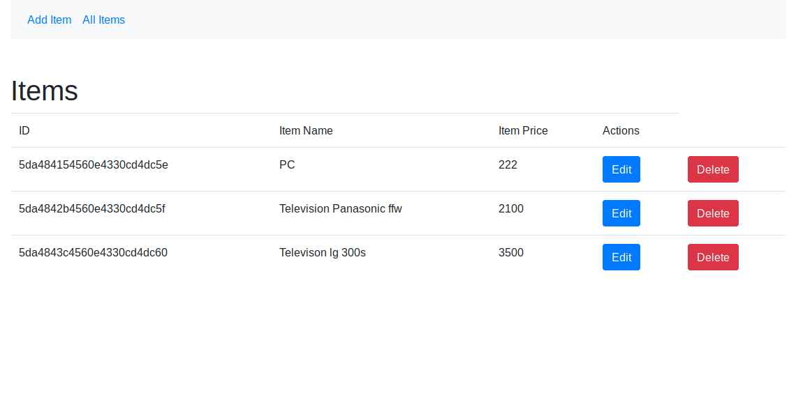

# VuejsCrudExample



Tutorial web: 
https://investmentnovel.com/vue-js-crud-example-tutorial-from-scratch/


En el archivo /src/components/Index.vue tiene un error que al eliminar un registro se elimina de la pantalla el que no es. Con lo cual se puede sustituir esta parte:

```
  deleteItem(id)
            {
              let uri = 'http://173.249.39.9:4000/items/delete/'+id;
              this.items.splice(id, 1);
              this.axios.get(uri);
            }
```
por esta otra:

```
 deleteItem(id)
            {
              let uri = 'http://173.249.39.9:4000/items/delete/'+id;
             
              this.axios.get(uri);
              this.fetchItems();
            }
```
